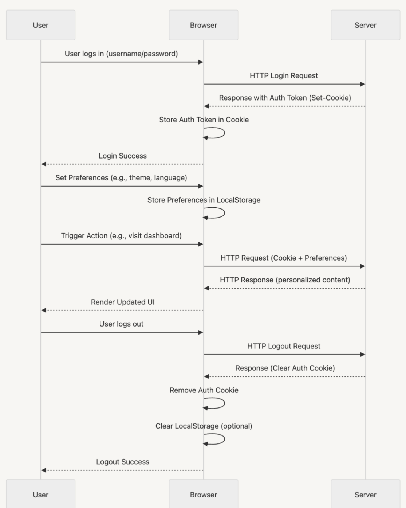

# Browser Memory & Caching&#x20;

## 1. Browser Memory vs Cache : 

### Browser Memory

* **Volatile**: Data is stored in RAM, making it extremely fast but temporary.
* **Scope**: Holds:

  * Active JavaScript variables and objects
  * React state (e.g., component-level state via `useState`)
  * Virtual DOM tree and diffs
  * Event listeners, closures, and DOM references
* **Lifecycle**:

  * Lives as long as the tab is open
  * Lost upon page refresh or tab close

#### Example:

```tsx
function Counter() {
  const [count, setCount] = useState(0); // Stored in browser memory
  return <button onClick={() => setCount(count + 1)}>Click {count}</button>;
}
```

Refreshing the page will reset the counter, because state is stored in memory.

---

###  Browser Cache (Disk-based)

* **Persistent**: Stored on disk, retained across sessions and page reloads.
* **Scope**:

  * Static assets (HTML, JS, CSS, fonts, images)
  * Fetched API responses (based on HTTP headers)
* **Lifecycle**:

  * Retained until:

    * Cache expiration
    * Manual invalidation (e.g., `Clear Site Data`)
    * Disk space pressure

#### Example: Static Assets

On first visit:

```http
GET /static/js/main.a1b2c3.js
Cache-Control: public, max-age=31536000, immutable
```

On subsequent visit:

```http
200 (from disk cache)
```

####  Example: Fetched API Responses

```http
GET /api/products
Cache-Control: public, max-age=300
ETag: "abc123"
```

Browser behavior:

* Within 5 minutes (`max-age=300`), response is reused from cache.
* After 5 minutes, browser sends:

```http
GET /api/products
If-None-Match: "abc123"
```
```js
DB / File / Memory
   ↓
Server computes ETag
   ↓
Response + ETag
   ↓
Client/CDN caches
   ↓
Client sends If-None-Match
   ↓
Server compares
```

If the data hasn't changed, server replies:

```http
304 Not Modified
```

This avoids re-downloading the full payload, improving performance.

---

## 2.  Types of Caching in Browsers

| Cache Type             | Description                                                          |
| ---------------------- | -------------------------------------------------------------------- |
| Memory Cache           | Fast, stored in RAM, active until tab is closed.                     |
| Disk Cache             | Files stored persistently on disk.                                   |
| HTTP Cache             | Governed by server response headers (e.g., `Cache-Control`, `ETag`). |
|                        |                                                                      |
| LocalStorage/IndexedDB | Manual storage for data persistence at the app level.                |

---

## 3. React App Load Lifecycle & Caching Behavior

###  First Load:

1. `index.html` is fetched.
2. Includes links to hashed JS, CSS, and image assets.
3. Browser downloads and parses, stores in memory.

### Subsequent Loads:

* Browser consults HTTP cache.
* If headers indicate it's still valid → uses cache.
* If invalid → fetches updated file.

### File Naming:

* CRA/Vite include hashes: `main.ab12cd.js`
* Updating source → new hash → new cache entry

---

## 4.  Cache-Control Headers&#x20;

we genrally add in Reverse proxy server (Nginx like or Aws CloudFront CDN), you can also add in backend server but it might lead little bit of latency issue as for each request it have to reach to server.

Example header:

```http
Cache-Control: public, max-age=31536000, immutable
```

| Header          | Purpose                                            |   |
| --------------- | -------------------------------------------------- | - |
| `Cache-Control` | Defines how long and where the response is cached. |   |
| `ETag`          | Entity Tag: Helps validate if a file has changed.  |   |
| `Last-Modified` | Timestamp to check freshness.                      |   |
| `Expires`       | Legacy header to indicate expiry time.             |   |

---

## 6. LocalStorage, SessionStorage, IndexedDB

### `localStorage`

* Synchronous, key-value
* Persistent across sessions
* 5-10MB limit (varies by browser)
* basic config like language pref and theme mode are stored here.

### `sessionStorage`

* Same API as localStorage
* Data is tab-specific
* Cleared on tab close
* Shopping checkout session : User has multiple tabs open on the same e-commerce site.
* Single-tab login flows (OAuth / Banking) : During a login redirect, you store state tokens or temporary auth codes in sessionStorage.

### `IndexedDB`

IndexedDB is a low-level API for client-side storage of significant amounts of structured data, including files/blobs. It uses indexes to enable high-performance searches and is asynchronous to avoid blocking the main thread.
IndexedDB is a NoSQL database because it is key-value/document-based without SQL joins, but it allows storing structured objects with indexes, enabling efficient queries
* IndexedDB data is not in RAM, but on disk
* Each origin is sandboxed → no cross-site access
```js
JS writes → IndexedDB API → Browser storage engine → Disk
JS reads → IndexedDB API → Storage engine → returns via async event

```

**Use IndexedDB when**:

*Offline-first applications*

- Store data locally when offline, sync later with server.

- Example: Google Docs, Notion offline mode.

*Large datasets in browser*

- Storing product catalogs, user history, cached content.

- Example: E-commerce sites storing millions of SKUs for fast browsing.

*Media-heavy apps*

- Storing video/audio/images offline.

- Example: Spotify Web Player caching songs.

*Performance-critical apps* 

- When you need fast read/write without hitting network.

- Example: Gmail storing emails in browser for instant load.


```js 
// Open (or create) database
let request = indexedDB.open("MyAppDB", 1);

// Run only when DB version changes
request.onupgradeneeded = function(event) {
  let db = event.target.result;
  let store = db.createObjectStore("users", { keyPath: "id" });
  store.createIndex("nameIndex", "name", { unique: false });
};

// Success handler
request.onsuccess = function(event) {
  let db = event.target.result;

  // Start transaction
  let tx = db.transaction("users", "readwrite");
  let store = tx.objectStore("users");

  // Add user
  store.add({ id: 1, name: "Ankit", role: "Teacher" });

  // Query by index
  let index = store.index("nameIndex");
  index.get("Ankit").onsuccess = function(e) {
    console.log("Found user:", e.target.result);
  };
};

```
### `Cookies` :

A cookie is a small key-value data string stored by the client browser, set via HTTP headers or JavaScript, and sent back to the server with each request to provide stateful interactions in web apps

```js
// set cookie (simple)
document.cookie = `theme=dark`;


// set with attributes
const value = encodeURIComponent('a value with ; and =');
document.cookie = `sessionId=${value}; Path=/; Max-Age=${60*60*24}; Secure; SameSite=Lax`;


// read all cookies
console.log(document.cookie); // "k1=v1; k2=v2"


// read one cookie (helper)
function getCookie(name) {
const cookies = document.cookie.split('; ').map(c => c.split('='));
for (const [k, ...rest] of cookies) {
if (k === name) return decodeURIComponent(rest.join('='));
}
return null;
}


// delete cookie (set expires in past)
function deleteCookie(name, options = {}){
document.cookie = `${name}=; Path=${options.path || '/'}; Expires=Thu, 01 Jan 1970 00:00:00 GMT;`;
}
```

 ## Session Mangement :



| Feature    | localStorage  | sessionStorage    | Cookies             | IndexedDB                          |
| ---------- | ------------- | ----------------- | ------------------- | ---------------------------------- |
| Max size   | \~5-10MB      | \~5-10MB          | 4KB                 | Hundreds MB – GB                   |
| Data type  | Strings only  | Strings only      | Strings only        | Structured (objects, files, blobs) |
| Expiry     | Persistent    | Until tab closed  | Configurable        | Persistent                         |
| Sync/Async | Synchronous   | Synchronous       | Sent with HTTP reqs | Asynchronous                       |
| Use case   | Small configs | Tab-based storage | Auth/session tokens | Large, complex offline storage     |


---

## 8.  Real World Example

```
dist/
├── index.html
├── assets/
│   ├── index.123abc.js
│   └── index.123abc.css
```

### Typical Cache Header:

```http
Cache-Control: public, max-age=31536000, immutable
```

* Cached for 1 year
* On new build → new filename → new cache

---

## 9.  Debugging Caching in Chrome

* **Network Tab**:

  * Check `Size` → `(from disk cache)` or `(memory cache)`
  * Use "Disable cache" to test fresh loads

* **Application Tab**:

  * Inspect: LocalStorage, SessionStorage, IndexedDB
  * Service Workers → update/skip waiting
  * Cache Storage → see what’s cached

---

## 10. ❌ Common Caching Pitfalls

| Mistake                         | Solution                           |
| ------------------------------- | ---------------------------------- |
| Reused filenames for new builds | Use hashed filenames.              |
|                                 |                                    |
| State lost on refresh           | Use `localStorage` or `IndexedDB`. |
| Large assets blocking memory    | Use lazy loading and chunking.     |

---

## 11. 🔐 Caching & Security Considerations in React

### ⚠️ Risks of Over-Caching

| Issue                              | Risk                                                         |
| ---------------------------------- | ------------------------------------------------------------ |
| **Sensitive data in localStorage** | Susceptible to XSS attacks; avoid storing auth tokens.       |
| **Stale service workers**          | Can serve outdated content if not updated correctly.         |
| **Public cache of private assets** | Misconfigured `Cache-Control` can expose user-specific data. |
| **Memory leaks**                   | Holding unnecessary references can exhaust RAM.              |

### ✅ Security Best Practices

* **Never store tokens in localStorage**: Use HTTP-only cookies for secure token handling.
* **Validate and sanitize inputs**: Prevent XSS that can access cache-stored data.
* **Use HTTPS**: Ensure all cached resources and service workers are served over HTTPS.
* **Configure cache headers correctly**: Set `no-store` or `private` for dynamic or user-specific endpoints.
* **Regularly update Service Workers**: Use versioning and call `skipWaiting()` + `clientsClaim()`.

---

## ✅ Best Practices

* Use long-term caching for hashed assets.
* Invalidate cache by changing file names (hash).
* Use SW for advanced scenarios (PWA/offline-first).
* Store important state in localStorage/IndexedDB.
* Monitor memory leaks using browser performance tools.

---

## 📌 Summary

| Feature       | Memory           | Cache Storage              |
| ------------- | ---------------- | -------------------------- |
| Lifespan      | Per session      | Persistent across sessions |
| Use Case      | App state, VDOM  | Static assets              |
| Controlled by | JS/React         | Browser + Server headers   |
| Optimized via | useMemo, cleanup | Cache headers, SW          |

Understanding these mechanisms will help you build **high-performance, resilient React apps** that load fast and behave predictably across sessions and updates.


## Global vs Script vs Block browser in memory
| Feature               | Global (`var`)  | Script (`let/const`) | Block (`let/const`) |
| --------------------- | --------------- | -------------------- | ------------------- |
| Attached to `window`  | ✅ Yes           | ❌ No                 | ❌ No                |
| Scope                 | Entire app      | Entire script file   | Only `{}` block     |
| Hoisting              | Yes (undefined) | Yes (TDZ)            | Yes (TDZ)           |
| Redeclaration allowed | ✅ Yes           | ❌ No                 | ❌ No                |
| Memory lifetime       | Page lifetime   | Script lifetime      | Block execution     |
| Recommended           | ❌ Avoid         | ✅ Yes                | ✅ Yes               |

# cache busting
“Cache busting is a technique to ensure that the browser/CDN loads the latest version of a resource instead of using a cached, stale version.”
# Auto broswer cache clear
Browsers don’t auto-clear cache, but using Cache-Control headers, ETag validation, cache-busting filenames, or service worker scripts, developers can ensure users always get the latest resources.
# EPOC time
# Eslinting


