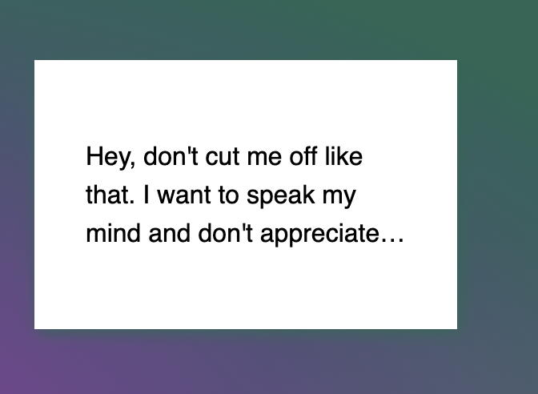

### WebKit in CSS

**Definition:**

* webKit is a HTML/CSS web browser rendering engine.
* In CSS, `-webkit-` is a vendor prefix indicating properties or features specifically implemented for WebKit-based browsers.

**Purpose of Prefixes:**

* Allow browsers to test experimental features without breaking future standards.
* Other prefixes: `-moz-` (Firefox), `-ms-` (Internet Explorer/old Edge), `-o-` (old Opera).

**Examples:**

```css
/* Rounded corners */
.my-box {
  -webkit-border-radius: 10px;
  border-radius: 10px;
}

/* Gradient background */
.my-box {
  background: -webkit-linear-gradient(left, red, blue);
  background: linear-gradient(to right, red, blue);
}

/* Text clamping */
.text {
  display: -webkit-box;
  -webkit-line-clamp: 3;
  -webkit-box-orient: vertical;
  overflow: hidden;
}
```

**Relevance Today (2025):**

* Most modern CSS properties no longer require vendor prefixes.
* Still essential for some features (e.g., `-webkit-line-clamp`, iOS touch/scroll behaviors).

**Summary:**
`-webkit-` in CSS ensures compatibility with WebKit-based browsers (Safari, Chrome, iOS). Mostly legacy today, but still needed for certain non-standard or partially supported features.

* The line-clamp property truncates text at a specific number of lines.

```css
.line-clamp {
  display: -webkit-box;
  -webkit-line-clamp: 3;
  -webkit-box-orient: vertical;  
  overflow: hidden;
}
```
