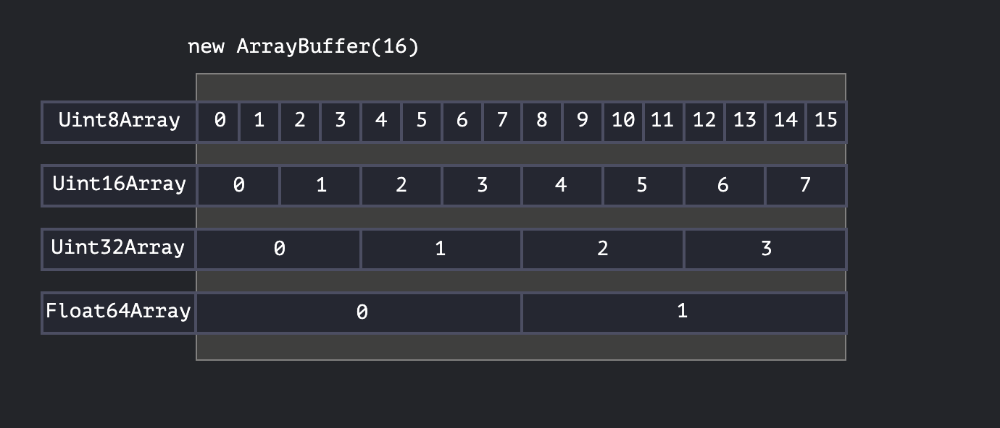

# JavaScript Binary Data 

## Overview
Binary data in JavaScript is primarily used for:
- File operations (create, upload, download)
- Image processing
- High-performance binary operations

### ArrayBuffer - The Foundation
- **Definition**: A reference to a fixed-length contiguous memory area
- **Characteristics**:
  - Fixed length (cannot be increased or decreased)
  - Takes exact space in memory
  - Contains raw sequence of bytes with no interpretation
  - Cannot access individual bytes directly (need a "view")

```javascript
let buffer = new ArrayBuffer(16); // creates 16-byte buffer
alert(buffer.byteLength); // 16
```

### View Objects - The "Eyeglasses"
Views provide interpretation of bytes stored in ArrayBuffer:

* one byte is 8 bit (11111111=>255)

#### Typed Arrays (Different Interpretations)
- **Uint8Array**: Each byte as number (0-255)
- **Uint16Array**: Every 2 bytes as integer (0-65535)
- **Uint32Array**: Every 4 bytes as integer (0-4294967295)
- **Float64Array**: Every 8 bytes as floating-point number



```javascript
let buffer = new ArrayBuffer(16);
let view = new Uint32Array(buffer); // 4 integers (16÷4=4)
alert(view.length); // 4
alert(view.byteLength); // 16
```

## TypedArray Details

### Common TypedArray Types
**Unsigned Integers:**
- `Uint8Array` - 8-bit (0 to 255)
- `Uint16Array` - 16-bit (0 to 65535) 
- `Uint32Array` - 32-bit (0 to 4294967295)
- `Uint8ClampedArray` - 8-bit with clamping behavior

**Signed Integers:**
- `Int8Array` - 8-bit signed
- `Int16Array` - 16-bit signed
- `Int32Array` - 32-bit signed

**Floating Point:**
- `Float32Array` - 32-bit float
- `Float64Array` - 64-bit float

### TypedArray Constructor Variants

1. **From ArrayBuffer:**
   ```javascript
   new TypedArray(buffer);
   ```

2. **From Array-like object:**
   ```javascript
   let arr = new Uint8Array([0, 1, 2, 3]);
   ```

3. **From another TypedArray:**
   ```javascript
   let arr16 = new Uint16Array([1, 1000]);
   let arr8 = new Uint8Array(arr16); // converts values
   ```

4. **With specified length:**
   ```javascript
   let arr = new Uint16Array(4); // 4 elements
   ```

5. **Empty array:**
   ```javascript
   let arr = new Uint16Array(); // zero-length
   ```

### Out-of-Bounds Behavior
When writing values that exceed the type's range:
- **Regular TypedArrays**: Extra bits are cut off (modulo operation)
- **Uint8ClampedArray**: Clamps values (255 for >255, 0 for negatives)

```javascript
let uint8array = new Uint8Array(16);
uint8array[0] = 256; // becomes 0 (256 % 256 = 0)
uint8array[1] = 257; // becomes 1 (257 % 256 = 1)
```

### TypedArray Methods
**Available methods:**
- All regular Array methods: `map`, `filter`, `reduce`, `slice`, `find`, etc.
- Iteration support: `for...of`, `forEach`

**Not available:**
- `splice` (can't delete, only assign zero)
- `concat`

**Special methods:**
- `arr.subarray([begin, end])` - creates new view (no copying)

### Accessing Underlying ArrayBuffer
```javascript
let arr8 = new Uint8Array([0, 1, 2, 3]);
let arr16 = new Uint16Array(arr8.buffer); // new view on same data
```

Properties:
- `buffer` - references the ArrayBuffer
- `byteLength` - length of the ArrayBuffer

## Best Practices

1. **Most common pattern**: Create and operate directly on TypedArrays
2. **Access underlying buffer** via `.buffer` property when needed
3. **Use DataView** for mixed-format or flexible data access

# Blob (Browser local memory for files or binary array)
A Blob (Binary Large Object) is a JavaScript object that represents immutable, raw data. It's a file-like object that can hold arbitrary binary data and is commonly used for file operations, data transfer, and working with binary content.

---

## syntax for string

```js
// Create a plain text blob
const blob = new Blob(["Hello World"], { type: "text/plain" });
```

* First argument = array of data (strings, ArrayBuffer, typed arrays, other Blobs).
* Second argument = options → `type` (MIME type).

JavaScript in the browser cannot directly open, edit, or delete files on your computer’s hard drive. It can only work with files that you explicitly provide (via file picker, drag-drop, clipboard, etc.) or create temporary ones in memory (via Blob).

## Blob URLs

* Browsers provide **temporary local URLs** for blobs.

```js
const url = URL.createObjectURL(blob);
document.querySelector("img").src = url;

// When done, free memory
URL.revokeObjectURL(url);
```

---

##  Why use Blob?

* Convert data → downloadable file
* Hide **real URLs** (e.g., signed S3 URLs)
* Process / preview binary data
* Work with images, video, audio inside browser

---

## Examples

### Display Image from Blob

```js
const response = await fetch("image.png");
const blob = await response.blob();
const url = URL.createObjectURL(blob);
document.querySelector("img").src = url;
```

### Download File from Blob

```js
const blob = new Blob(["Hello File"], { type: "text/plain" });
const url = URL.createObjectURL(blob);

const a = document.createElement("a");
a.href = url;
a.download = "hello.txt";
a.click();
URL.revokeObjectURL();
```

* Always call URL.revokeObjectURL() when finished to free memory
---

##  Real-world: S3 Example

* **Directly show file** → just use S3 URL.
* **Need processing / security** → fetch S3 URL → convert to Blob → use Blob URL.
* **Editing/re-uploading** → Blob works like a local file.

---

**Summary:** 
Blob = JS way to treat binary data as files inside browser memory.


# FileReader

## FileReader
**Purpose**: Asynchronously reads the contents of files or blobs
**Type**: Web API interface
**Usage**: Reading and processing file data

### Key Methods:
- `readAsText(file)` - Reads as plain text
- `readAsDataURL(file)` - Reads as base64 data URL
- `readAsArrayBuffer(file)` - Reads as binary array buffer
- `readAsBinaryString(file)` - Reads as binary string (deprecated)

### Events:
- `onload` - When reading completes successfully
- `onerror` - When reading fails
- `onprogress` - During reading progress
- `onloadstart` - When reading starts
- `onloadend` - When reading ends (success or failure)

### Example:
```javascript
const fileReader = new FileReader();
fileReader.onload = (event) => {
    console.log(event.target.result);
};
fileReader.readAsText(file);
```

## Key Differences

| Aspect | FileReader | Blob |
|--------|------------|------|
| **Purpose** | Reads/processes file data | Stores raw binary data |

## When to Use Each

### Use FileReader when:
- Reading uploaded files from `<input type="file">`
- Converting files to different formats (text, base64, etc.)

### Use Blob when:
- Creating downloadable files in browser
- Storing binary data temporarily
- Working with fetch API responses
- Creating object URLs for media files

## Common Workflow
```javascript
// 1. Get file from input
const file = document.querySelector('input[type="file"]').files[0];

// 2. FileReader processes the file
const reader = new FileReader();
reader.onload = () => {
    // 3. Create new Blob with processed data
    const blob = new Blob([reader.result], { type: file.type });
    
    // it, recreates it as a new Blob, and prepares a blob URL (which you can use to preview, download, or send via network).
    const url = URL.createObjectURL(blob);
};
reader.readAsText(file);

```