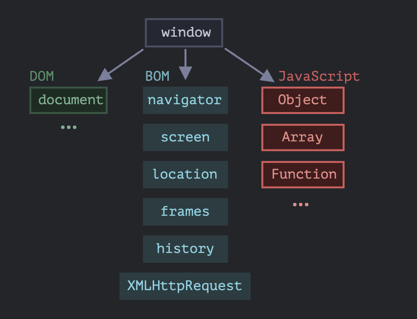
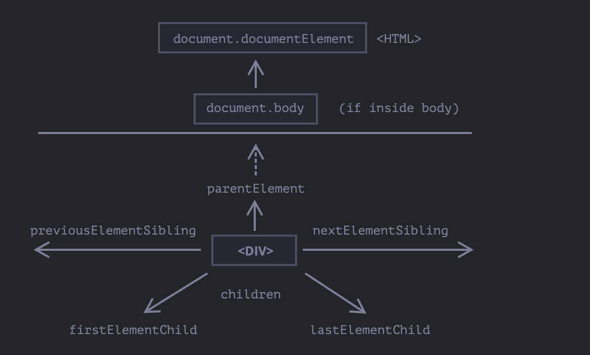

# JavaScript and Browser

## Window Object
**Root object in browsers** - 
which is also a  `Global Object` and All global functions/variables become `window` properties.



## Key Points
- **DOM**: Page content manipulation
- **BOM**: Browser-specific functionality
- **CSSOM**: Style rule management
- **Window**: Global object + browser control
- Each environment adds objects to JavaScript core

**DOM Tree**
* DOM Structure: HTML documents become tree structures where tags are element nodes and text content forms text nodes.

* Table Exception: Tables always get <tbody> tags automatically inserted by the browser, even if omitted in HTML

* Developer Tools: Use browser dev tools to inspect DOM structure, with shortcuts like $0 for selected elements and previously selected element as $1

example :
```js
$0.style.background = 'red'
```
## DOM LEVEL

